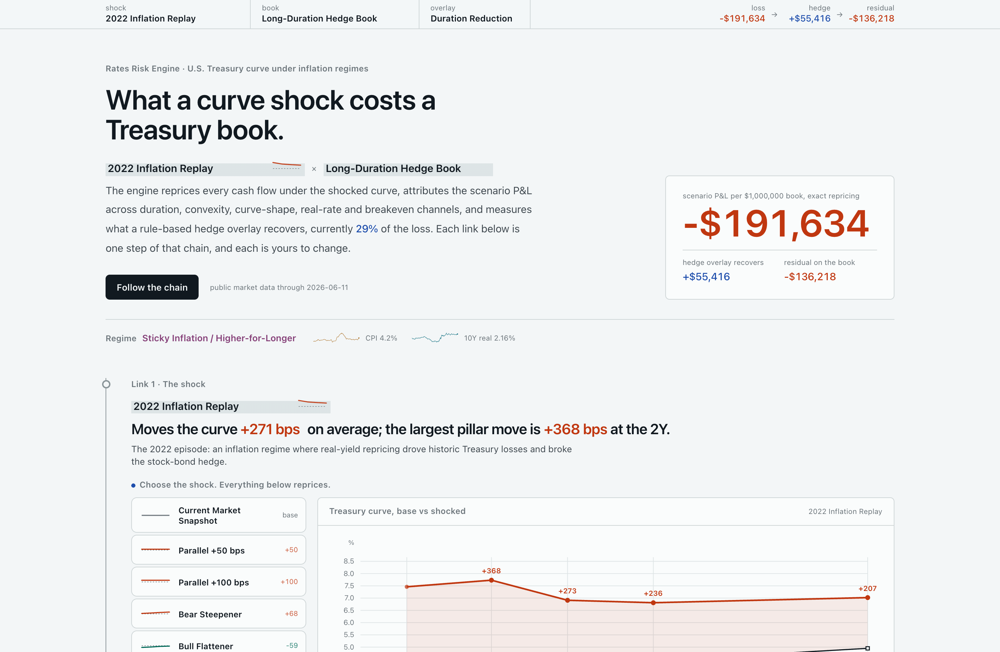
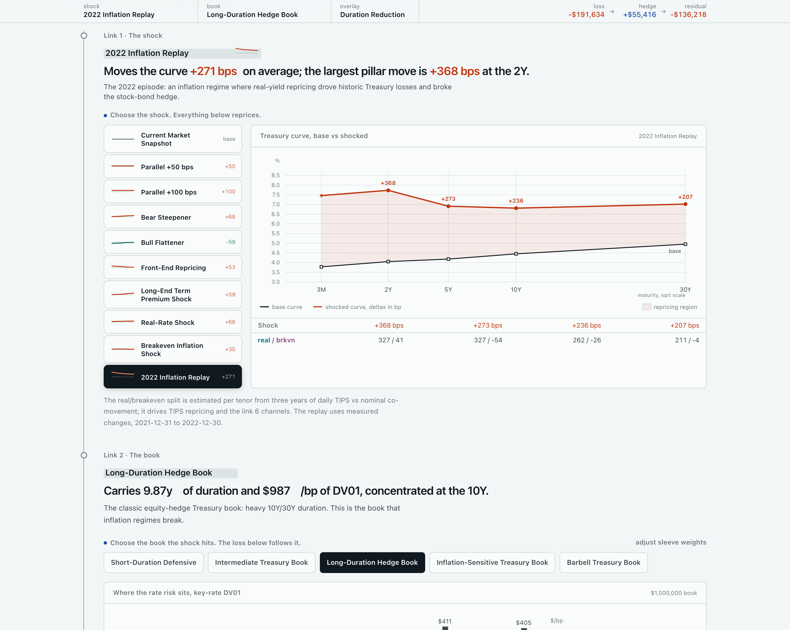
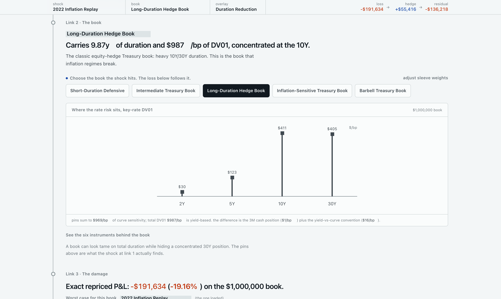
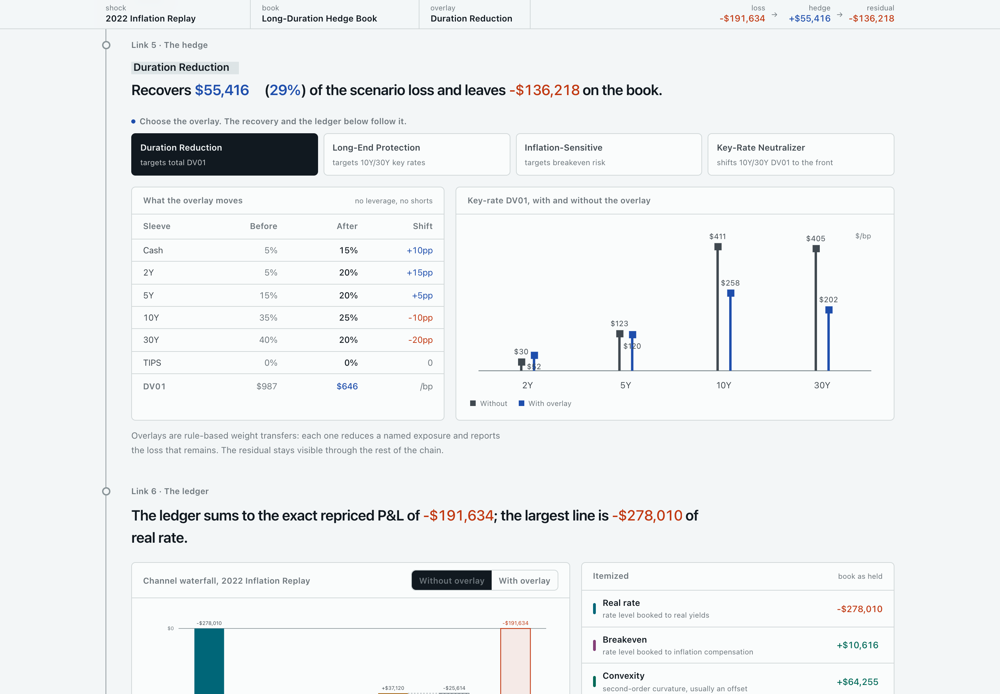
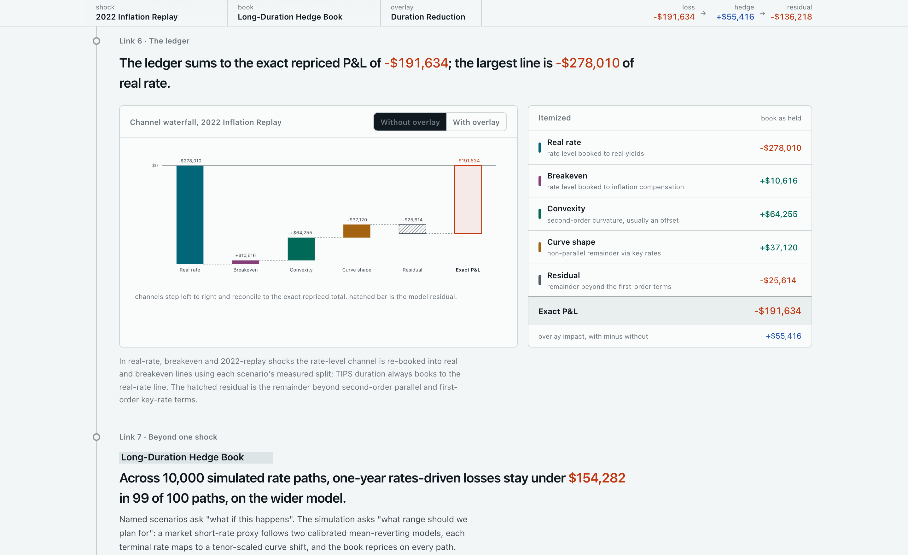
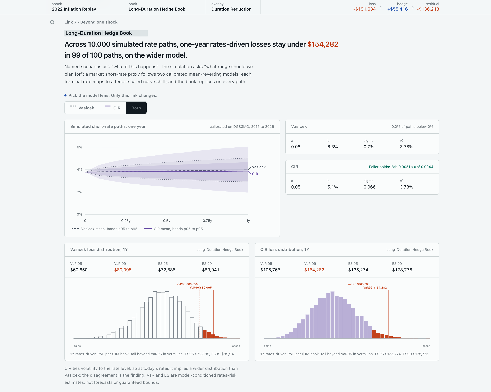
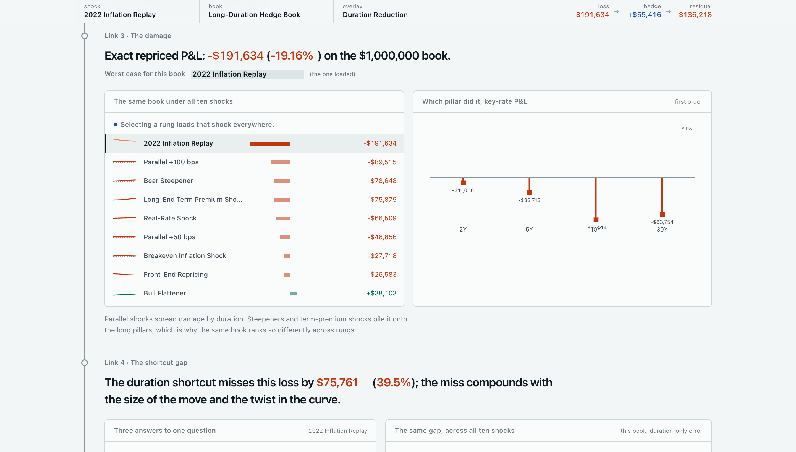

# Rates Risk Engine

**A U.S. Treasury / rates-risk attribution engine under inflation regimes.**

Pick an inflation-regime curve shock and a Treasury book, and the engine
reprices every cash flow under the shocked curve, attributes the resulting
P&L across duration, convexity, curve-shape, real-rate and breakeven channels,
measures what a rule-based hedge overlay recovers, and frames the single shock
against a Vasicek/CIR rates-risk simulation.

Every number is generated offline by a reproducible Python pipeline from
public market data. The site makes no live API calls and prices nothing in the
browser.



---

## What it answers

The classic long-duration Treasury book is the textbook equity hedge, and 2022
showed how an inflation regime breaks it: real yields repriced sharply, the
curve bear-flattened, and the "safe" hedge produced historic losses alongside
equities. The engine measures that mechanism end to end and lets you change
each step:

```
Regime → Curve shock → Treasury book → Repricing → Hedge overlay → Attribution → Rates-risk simulation
```

The interface is a causal chain read top to bottom. It opens on a worked result
(the measured 2022 replay against the long-duration hedge book) and rebuilds the
loss link by link. Each link owns at most one control, placed where its
consequence begins; a sticky register carries the running state
(shock × book × overlay → loss → hedge recovery → residual) so every change has
a visible answer.

| Link | What it shows | Control |
| --- | --- | --- |
| **1. The shock** | Base vs shocked Treasury curve (3M to 30Y), per-pillar deltas, and each shock's real / breakeven split, including a measured 2022 inflation replay. | 10 shock scenarios; shape glyphs distinguish steepeners, flatteners and parallel shifts at a glance. |
| **2. The book** | Modified duration, total DV01, and key-rate DV01 by pillar; the six synthetic instruments behind the book on request. | 5 preset Treasury books, plus auto-normalizing sleeve weight faders (no leverage, no shorts). |
| **3. The damage** | Exact repriced P&L, a stress ladder ranking all ten shocks for the active book, and key-rate P&L by pillar. | The ladder doubles as a shock selector. |
| **4. The shortcut gap** | Duration-only vs convexity-adjusted vs exact repricing, with the dollar and percentage error of each shortcut, plotted against shock size across every scenario. | None; consequence only. |
| **5. The hedge** | Sleeve shifts, DV01 change, key-rate DV01 with and without the overlay, recovery percentage, and the residual that remains. | 4 rule-based overlays, each labeled with the exposure it targets. |
| **6. The ledger** | A channel waterfall and itemized ledger reconciling exact P&L into duration, real-rate, breakeven, convexity, curve-shape and a residual line. | Toggle the ledger with or without the overlay. |
| **7. Beyond one shock** | Vasicek vs CIR simulated short-rate paths (10,000), the CIR Feller condition, and 1-year rates-driven VaR / ES per book with loss distributions. | Choose the model lens (Vasicek, CIR, or both). |
| **Fine print** | Data sources, assumptions, simplifications and limitations, plus the data manifest. | Accordion. |

| | |
| --- | --- |
|  |  |
|  |  |
|  |  |

## Data and as-of logic

All inputs are public daily FRED series, processed offline:

- **Nominal curve**: DGS2, DGS5, DGS10, DGS30, plus DGS3MO for the short rate.
- **Real yields**: DFII5, DFII10, DFII30.
- **Breakeven inflation**: T5YIE, T10YIE.
- **Inflation**: CPIAUCSL, CPILFESL (year-over-year).
- History window 2015 to present for calibration and regime context.

The market snapshot uses the latest date on which the daily rate series are all
available; the current build is as of **2026-06-11**. CPI is monthly and is
dated separately (**2026-05**) rather than forced onto the daily date. Each
scenario's real vs breakeven split is estimated per tenor from three years of
daily co-movement between TIPS and nominal yields, except where the split is
definitional (a pure real-rate or pure breakeven shock). The 2022 replay is the
measured nominal and real curve change between the last business days of 2021
and 2022 (**2021-12-31 to 2022-12-30**).

**Instruments are synthetic Treasury-style proxies, not CUSIP-level
securities.** They are built from the latest curve snapshot with coupons set
near par (rounded to eighths), semiannual schedules, and issuance on coupon
dates so accrued interest is zero. The TIPS-style sleeve is priced off the real
curve only and does not model index-ratio cash flows.

## Architecture

```
public FRED data ──► Python pipeline ──► static JSON/CSV ──► Next.js frontend
                     research/scripts     public/data/        (no live calls, no browser pricing)
```

- **Quant engine** (`research/scripts/`): a transparent custom implementation:
  curve interpolation, cash-flow discounting (semiannual compounding), Macaulay
  and modified duration, convexity, DV01, key-rate durations (1bp pillar bumps),
  exact scenario repricing, additive P&L attribution, rule-based hedge overlays,
  AR(1)-calibrated Vasicek and OLS-calibrated CIR short-rate models, a
  tenor-scaled short-rate-to-curve mapping, and VaR / ES from the simulated loss
  distributions.
- **Frontend** (`src/`): Next.js 15, TypeScript, Tailwind 4, Framer Motion,
  shadcn/ui primitives and Zustand, exported as a fully static site. Interactive
  panels never price bonds; they recombine precomputed per-instrument results
  (weighted sums), verified to reproduce the Python engine's portfolio P&L to
  within one cent. Live values animate in width-reserved slots so updates never
  shift the layout. The page is fully responsive from 320px up; dense charts and
  tables scroll horizontally inside their own containers while the page itself
  never does.

## Analytics covered

Curve construction and shocks; clean pricing; Macaulay and modified duration;
convexity; DV01; key-rate DV01; exact repricing versus duration-only and
convexity-adjusted approximations; rule-based hedge overlays with effectiveness
and residual measurement; additive P&L attribution (duration, convexity,
curve-shape, real-rate, breakeven, residual); Vasicek and CIR short-rate
calibration with the Feller condition; and 1-year rates-driven VaR and Expected
Shortfall.

## Validation

The pipeline ends with a sanity gate (`research/scripts/sanity_checks.py`,
40 checks, all passing) and a reconciliation audit
(`research/scripts/quant_audit.py`) that prints concrete numbers, including:

- price-yield inversion and duration / convexity monotonic in maturity
  (2Y 1.90 to 30Y 15.73 modified duration).
- analytic duration and convexity within 0.5% of finite-difference repricing.
- convexity-adjusted repricing strictly closer than duration-only for large
  parallel shocks.
- attribution channels reconcile to exact repriced P&L (max error about one cent
  across all preset by scenario rows; about two cents across hedge pre/post rows).
- portfolio DV01 reconciles with key-rate DV01 plus the off-pillar cash position
  and the yield-versus-curve convention difference, documented per instrument.
- each overlay reduces the exposure it targets across all five books; residual
  loss stays visible.
- long-duration VaR exceeds short-duration VaR under both models; ES at least
  VaR; the CIR Feller condition computed from raw, unrounded parameters.
- the 2022 replay recomputed from raw data matches the exported shocks.

Validation notebooks are in `research/notebooks/`.

## Running it

```bash
# 1. research pipeline: fetch FRED data and regenerate all static outputs
python3 research/scripts/run_pipeline.py           # --skip-fetch reuses cached raw CSVs

# 2. frontend
npm install
npm run dev                                        # http://localhost:3000
npm run build                                      # static export to out/

# optional: print the reconciliation audit
python3 research/scripts/quant_audit.py
```

Requires Node 18+ and Python 3.9+ (numpy, pandas, scipy). The pipeline writes to
`data/processed/` and `public/data/`; the frontend reads only the static files in
`public/data/`. Deploy by serving the static `out/` directory (for example via
Netlify or Vercel with build command `npm run build` and publish directory
`out/`).

## Limitations

- Synthetic Treasury-style proxies, not CUSIP-level securities or live prices.
- The TIPS-style sleeve reprices off the real curve only; index-ratio cash flows
  are not modeled.
- Stylized shocks are analytical stress tests, not forecasts; only the 2022
  replay is a measured historical episode.
- The 2Y real / breakeven split borrows the 5Y estimate, since there is no 2Y
  TIPS constant-maturity series.
- Vasicek and CIR are stylized short-rate models, not full term-structure models;
  the short-rate-to-curve mapping is a documented tenor-scaled approximation, and
  carry and roll-down over the horizon are excluded.
- VaR and ES are model-conditioned rates-risk estimates, not forecasts or
  guaranteed loss bounds.
- Hedge overlays reduce selected exposures; residual risk always remains and is
  always displayed.

Outputs are analytical estimates under the stated assumptions. Not investment
advice, not a trading system, and not a production risk platform.
